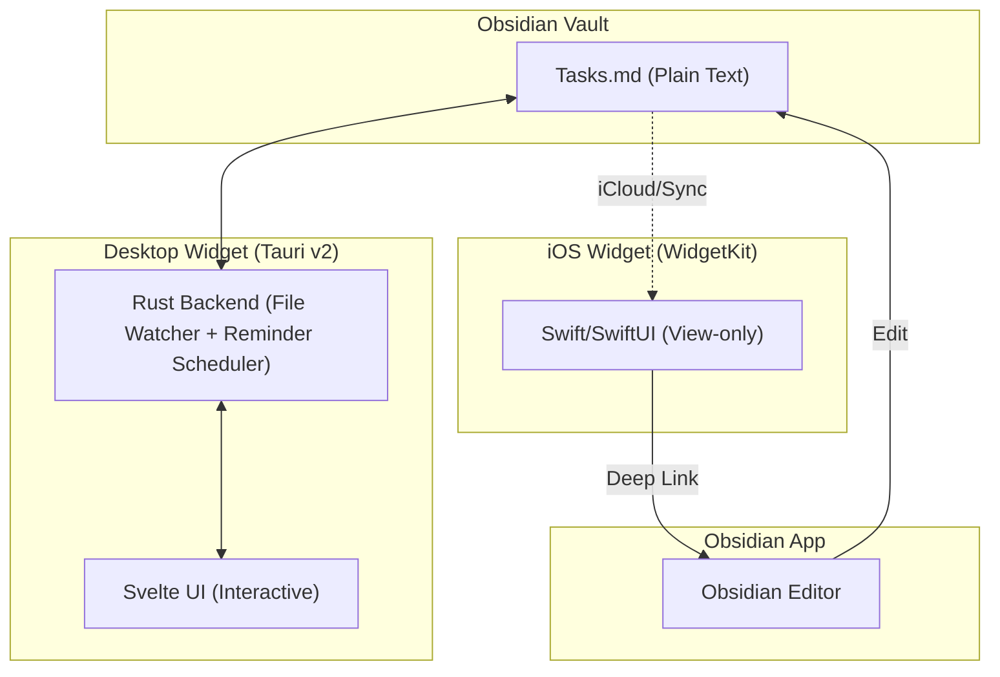

# Obsidian Live Widget (`ob-widget`)

Developed by: **Uves Arshad** ([@uvesarshad](https://x.com/uvesarshad))

A persistent, interactive desktop widget that mirrors your Obsidian task list in real time, with built-in reminders, a calendar picker, and visual + audio alarms.

[](LICENSE)
[](#getting-started)
[](https://tauri.app)
[](https://svelte.dev)
[](CONTRIBUTING.md)

---

## About

**Obsidian Live Widget** is a lightweight floating widget that brings your Obsidian task lists directly to your desktop (Windows / macOS). It eliminates the friction of opening the full Obsidian app just to check off a quick task, add a new one, or set a reminder.

- **Desktop (Windows / macOS):** Fully interactive, frameless, frosted-glass widget built with **Tauri v2** and **Svelte 5**.
- **iOS:** A native **WidgetKit** extension for viewing tasks with a deep link to open the note in Obsidian. *(in progress)*

### Features

- 📝 **Live two-way sync** with any Obsidian markdown file — edits in Obsidian appear in the widget within ~1 second, and vice versa
- ⏰ **Reminders** with a calendar + time picker — type `@` in the task input to set one
- 🔔 **Visual + audio alarm** — outward pulse waves around the widget, looping sound until you hit **Okay** or **Snooze 10 min**
- 🎵 **5 built-in alarm tones** (chime, bell, beep, digital, soft) plus support for **custom audio files** (.mp3, .wav, .ogg, .m4a, .flac, .aac)
- 🪟 **Frameless, always-on-top, fully transparent** with platform-native frosted glass (Acrylic on Windows, Vibrancy on macOS)
- 🎨 **Theme cycling** — system / light / dark
- 🌫️ **Adjustable transparency** slider
- ⌨️ **Customizable global shortcut** to bring the widget to focus from anywhere
- 🗂️ **System tray integration** with launch-at-login
- ✏️ **Inline task editing** — toggle done, double-click to edit, hover to delete, type at the bottom to add
- 📐 **Markdown-aware** — renders headings, bullets, separators, **bold**, *italic*, ~~strikethrough~~, and `code`
- 💾 **Settings persist** across restarts (window position, theme, opacity, shortcut, tone choice)

### Screenshots

<p align="center">
  
  &nbsp;
  
</p>
<p align="center">
  
  &nbsp;
  
</p>
<p align="center">
  
  &nbsp;
  
</p>
<p align="center">
  
</p>

---

## How to Use

### First Launch — Pick Your Note File

On first launch the widget shows a **setup screen**:

1. Click **"Choose Note File"**
2. Navigate to any markdown file inside your Obsidian vault (typically `Tasks.md`)
3. Click **Open**

The widget immediately reads the file and displays your tasks. Edits flow both ways from that point on.

> **What counts as a task?** Any line matching standard Obsidian task syntax: `- [ ] Incomplete` or `- [x] Done`. Every other line (headings, blank lines, paragraphs, bullets) is preserved verbatim in the file but rendered as read-only context in the widget.

### Daily Actions

| Action | How |
|---|---|
| **Toggle done / undone** | Click the checkbox |
| **Edit a task** | Double-click the text → type → `Enter` or click away |
| **Add a task** | Type in the bottom input → `Enter` |
| **Set a reminder** | Type `@` in the input — the calendar opens; pick date + time → **Set reminder** |
| **Delete a task** | Hover the task → click the `×` button |
| **Move the widget** | Click and drag the header bar |
| **Resize the widget** | Drag any edge or corner |
| **Hide / show** | Click the `×` on the title bar to hide; left-click the tray icon to bring it back |
| **Quit** | Right-click tray icon → **Quit** |

### Customization

- **Change vault / note file** — Right-click the tray icon → **Choose Note File…**, or click the setup button if no file is selected.
- **Change reminder tone** — Click the 🔔 bell icon in the header. Pick a built-in tone, preview with ▶, or click **Browse…** to load a custom audio file.
- **Change transparency** — Click the opacity icon (half-filled circle) in the header → drag the slider.
- **Toggle always-on-top** — Click the pin icon in the header, or use the tray menu.
- **Cycle theme** — Click the sun / moon / half-disc icon in the header to cycle `system → light → dark`.
- **Set a custom keyboard shortcut** — Right-click the bring-to-top (▲) icon in the header → click **Record** → press your key combo. Default: `Ctrl+Shift+O` (Windows) / `Cmd+Shift+O` (macOS).
- **Snooze a reminder** — When the alarm fires, click **Snooze 10 min**. The task's `(@time)` tag in the markdown file is rewritten automatically.

### Real-Time Sync

The widget uses a native filesystem watcher (NTFS on Windows, FSEvents on macOS). Changes from **Obsidian**, **Obsidian Sync**, **iCloud Drive**, or **Syncthing** flow into the widget automatically — no polling, no manual refresh.

### Settings File

Settings are saved automatically at:

- **Windows:** `%APPDATA%\ob-widget\settings.json`
- **macOS:** `~/Library/Application Support/ob-widget/settings.json`

Reminder data lives alongside it in `reminders.json`. Both files are plain JSON and safe to edit while the widget is closed.

---

## Getting Started

### Option 1 — Download from Releases (Recommended)

Pre-built installers for Windows and macOS are attached to every GitHub Release:

👉 **[Download the latest release](https://github.com/uvesarshad/ob-widget/releases)**

- **Windows:** download `ob-widget_<version>_x64_en-US.msi` (or the NSIS `-setup.exe` if you prefer), double-click to install. Appears in Start menu and Add/Remove Programs like any normal app.
- **macOS:** download `ob-widget_<version>_x64.dmg`, drag the app into `/Applications`. First launch requires right-click → **Open** (Gatekeeper) because the build is not yet code-signed.

After install, the tray menu has a **Launch at Login** toggle — flip it once and the widget starts automatically on every boot.

### Option 2 — Build Manually

Build from source on your own machine.

#### Prerequisites

| Tool | Version | Install |
|---|---|---|
| Rust | ≥ 1.77 | [rustup.rs](https://rustup.rs) |
| Node.js | ≥ 18 | [nodejs.org](https://nodejs.org) |
| cargo-tauri CLI | ≥ 2 | `cargo install tauri-cli` |
| WebView2 (Windows) | any | Bundled with Windows 11 |
| Xcode CLT (macOS) | any | `xcode-select --install` |

#### 1 — Clone and install

```bash
git clone https://github.com/uvesarshad/ob-widget
cd ob-widget
npm install
```

#### 2 — Run in dev mode

```bash
npm run tauri dev
```

The widget window opens after Rust compiles (~2 min on first run, seconds after that).

#### 3 — Build a release binary

```bash
npm run tauri build
```

#### Build artifacts

**Windows** (run the build on any Windows machine):

```
src-tauri/target/release/bundle/
  msi/ob-widget_0.1.0_x64_en-US.msi     ← share this for installation
  nsis/ob-widget_0.1.0_x64-setup.exe    ← alternative NSIS installer
```

**macOS** (must be built on a Mac):

```
src-tauri/target/release/bundle/
  dmg/ob-widget_0.1.0_x64.dmg
  macos/ob-widget.app
```

Without an Apple Developer certificate, macOS users see a Gatekeeper warning on first launch. With a $99/yr Developer account you can sign and notarize via the existing `.github/workflows/release.yml` (the workflow auto-detects whether Apple secrets are configured).

---

## Architecture



For a deeper dive, see [docs/overview.md](docs/overview.md) and the rest of [/docs](docs/).

---

## iOS Widget *(in progress)*

See `temp/TODO.md` Phase 2 for status. Once the companion app is built:

1. Open the companion app → enter your vault name and file name
2. Long-press your Home Screen → **+** → search "Obsidian Live Widget"
3. Choose Small, Medium, or Lock Screen size
4. Tap the widget to open the note directly in Obsidian

---

## Project Status

- [x] Windows desktop widget (Tauri v2 + Svelte 5)
- [x] macOS desktop widget (Tauri v2 + Svelte 5)
- [x] Reminder system (calendar picker, scheduler, pulse alarm, custom tones)
- [ ] iOS WidgetKit extension *(in progress)*
- [ ] Android *(not planned for v1)*

---

## Recommended IDE Setup

[VS Code](https://code.visualstudio.com/) + [Svelte](https://marketplace.visualstudio.com/items?itemName=svelte.svelte-vscode) + [Tauri](https://marketplace.visualstudio.com/items?itemName=tauri-apps.tauri-vscode) + [rust-analyzer](https://marketplace.visualstudio.com/items?itemName=rust-lang.rust-analyzer)

---

## Documentation

Full project documentation lives in [/docs](docs/) and is written for both humans and AI coding agents.

**Start here: [docs/overview.md](docs/overview.md)**

The overview contains the project's tech stack, architecture decisions, directory map of all doc files, and a glossary of domain terms. All other doc files are linked from there.

AI agents (Claude Code, Gemini CLI, Codex, Cursor, etc.) should read [docs/overview.md](docs/overview.md) before making any changes to this codebase. See [AGENTS.md](AGENTS.md) for the agent bootstrap instructions.

---

## Contributing

Contributions are very welcome — bug reports, feature ideas, docs improvements, and pull requests.

- 🐛 **Found a bug?** Open an issue using the [bug report template](.github/ISSUE_TEMPLATE/bug_report.md).
- 💡 **Have a feature idea?** Open an issue using the [feature request template](.github/ISSUE_TEMPLATE/feature_request.md).
- 🛠️ **Want to submit code?** Read [CONTRIBUTING.md](CONTRIBUTING.md) first — it covers the dev setup, code style, commit conventions, and PR workflow.
- 🤝 **Code of Conduct** — by participating, you agree to abide by the [Contributor Covenant](CODE_OF_CONDUCT.md).
- 🔐 **Security issue?** Please follow [SECURITY.md](SECURITY.md) — do not file a public issue for vulnerabilities.

### Quick-start for contributors

```bash
# 1. Fork the repo on GitHub, then clone your fork
git clone https://github.com/<your-username>/ob-widget
cd ob-widget

# 2. Install and run
npm install
npm run tauri dev

# 3. Create a branch, make your change, push, open a PR
git checkout -b feat/your-feature
git commit -am "feat: short description"
git push origin feat/your-feature
```

---

## License

MIT © 2026 [Uves Arshad](https://x.com/uvesarshad). See [LICENSE](LICENSE) for details.
