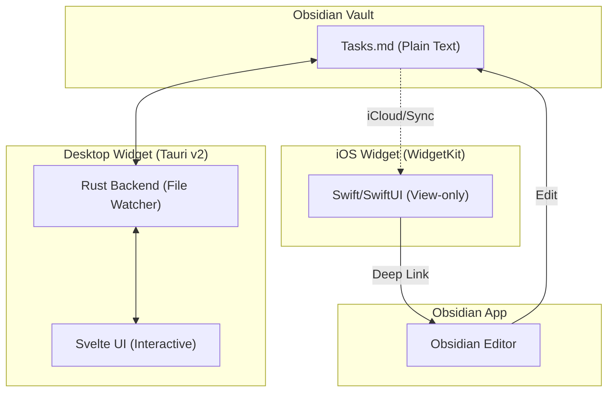

# Obsidian Live Widget (`ob-widget`)

Developed by: **Uves Arshad** ([@uvesarshad](https://x.com/uvesarshad))

A persistent, interactive desktop and mobile widget for your Obsidian tasks.

## About

**Obsidian Live Widget** is a lightweight application designed to bring your Obsidian task lists directly to your desktop (Windows/macOS) and iOS home screen. It eliminates the friction of opening the full Obsidian app just to check off a quick task or see what's next on your list.

- **Desktop (Windows/macOS):** Fully interactive, frameless, and vibrant (Mica/Acrylic/Glass) widget built with **Tauri v2** and **Svelte**.
- **iOS:** A native **WidgetKit** extension for viewing tasks with deep links to open the note directly in Obsidian.

## Use Case

- **Quick Task Management:** Toggle checkboxes, edit task text, and add new items without leaving your current workspace.
- **Ambient Awareness:** Keep your daily "To-Do" note visible at all times as a beautiful, semi-transparent widget.
- **Zero Sync Infrastructure:** Works directly with your local `.md` files. Sync between devices is handled by your existing setup (Obsidian Sync, iCloud, Syncthing, etc.).

## High-Level Architecture

## Recommended IDE Setup

[VS Code](https://code.visualstudio.com/) + [Svelte](https://marketplace.visualstudio.com/items?itemName=svelte.svelte-vscode) + [Tauri](https://marketplace.visualstudio.com/items?itemName=tauri-apps.tauri-vscode) + [rust-analyzer](https://marketplace.visualstudio.com/items?itemName=rust-lang.rust-analyzer).
