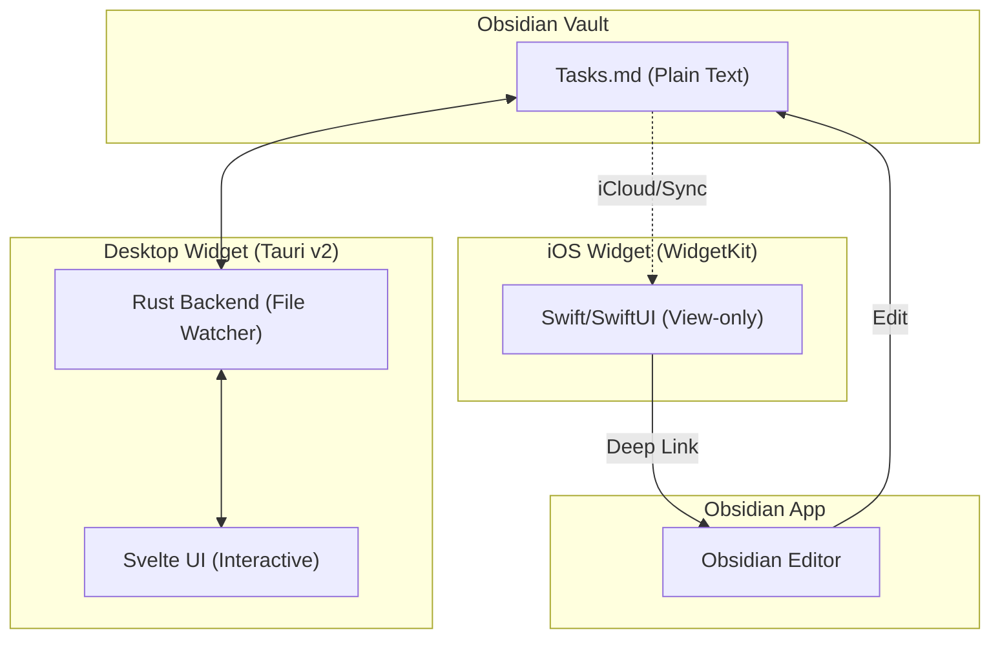

# Obsidian Live Widget (`ob-widget`)

Developed by: **Uves Arshad** ([@uvesarshad](https://x.com/uvesarshad))

A persistent, interactive desktop and mobile widget for your Obsidian tasks.

## About

**Obsidian Live Widget** is a lightweight application designed to bring your Obsidian task lists directly to your desktop (Windows/macOS) and iOS home screen. It eliminates the friction of opening the full Obsidian app just to check off a quick task or see what's next on your list.

- **Desktop (Windows/macOS):** Fully interactive, frameless, vibrant (Mica/Glass) widget built with **Tauri v2** and **Svelte**.
- **iOS:** A native **WidgetKit** extension for viewing tasks with a deep link to open the note in Obsidian. *(in progress)*

## High-Level Architecture



---

## Prerequisites

| Tool | Version | Install |
|---|---|---|
| Rust | ≥ 1.77 | [rustup.rs](https://rustup.rs) |
| Node.js | ≥ 18 | [nodejs.org](https://nodejs.org) |
| cargo-tauri CLI | ≥ 2 | `cargo install tauri-cli` |
| WebView2 (Windows) | any | Bundled with Windows 11 |
| Xcode (iOS only) | ≥ 15 | Mac App Store |

---

## Getting Started (Desktop)

### 1 — Clone and install

```bash
git clone https://github.com/uvesarshad/ob-widget
cd ob-widget
npm install
```

### 2 — Run in dev mode

```bash
npm run tauri dev
```

The widget window opens after Rust compiles (~2 min on first run, seconds after that).

### 3 — Build a release binary

```bash
npm run tauri build
```

#### What the build produces

**Windows** — run the build on any Windows machine:

```
src-tauri/target/release/bundle/
  msi/ob-widget_0.1.0_x64_en-US.msi     ← share this for installation
  nsis/ob-widget_0.1.0_x64-setup.exe    ← alternative NSIS installer
```

Double-click the `.msi` to install → shows up in Start menu and Add/Remove Programs, works like any Windows app.

**macOS** — must be built on a Mac:

```
src-tauri/target/release/bundle/
  dmg/ob-widget_0.1.0_x64.dmg
  macos/ob-widget.app
```

Without an Apple Developer certificate, users need to right-click → **Open** on first launch (Gatekeeper warning). With a $99/yr Developer account you can sign and notarize to avoid that.

#### Launch at Login

The tray menu has a **"Launch at Login"** toggle. Check it once after installing and the widget starts automatically on every boot — no terminal, no dev server.

- **Windows:** writes an entry to `HKEY_CURRENT_USER\SOFTWARE\Microsoft\Windows\CurrentVersion\Run`
- **macOS:** installs a LaunchAgent plist in `~/Library/LaunchAgents/`

#### macOS build (from a Mac)

```bash
# On your Mac, clone the repo and run:
npm install
npm run tauri build
```

#### GitHub Actions (build both from one push)

To produce Windows and macOS installers automatically without needing two machines, add a `.github/workflows/release.yml` that builds in CI and attaches the artifacts to a GitHub Release.

---

## How to Use

### First Launch — Pick Your Vault

On first launch the widget shows a **setup screen**:

1. Click **"Choose Vault Folder"**
2. Navigate to your Obsidian vault root (the folder that contains your `.md` files)
3. Click **Select**

The widget immediately reads `Tasks.md` from that folder and displays your tasks. To use a different file name, right-click the tray icon → **Change Target File**.

> **What counts as a task?** Any line matching standard Obsidian task syntax:
> ```
> - [ ] Incomplete task
> - [x] Completed task
> ```
> All other lines (headings, blank lines, paragraphs) are preserved in the file but not shown in the widget.

---

### Daily Use

| Action | How |
|---|---|
| **Toggle done/undone** | Click the checkbox |
| **Edit task text** | Double-click the text → type → `Enter` or click away |
| **Add a new task** | Type in the bottom input → `Enter` |
| **Delete a task** | Hover the task → click the `×` button that appears |
| **Move the widget** | Click and drag the header bar |
| **Resize the widget** | Drag any edge or corner |
| **Hide the widget** | Click the `×` title-bar button (minimises to tray, does not quit) |
| **Show the widget** | Left-click the tray icon |
| **Quit** | Right-click tray icon → **Quit** |

### Tray Icon Menu

Right-click the tray icon for options:

| Item | Effect |
|---|---|
| **Change Target File…** | Opens a folder picker — choose a new vault folder. The target file name stays the same (default: `Tasks.md`). |
| **Always on Top** ✓ | Toggle whether the widget floats above other windows |
| **Click-through** | Toggle whether mouse clicks pass through the widget when it is not focused |
| **Launch at Login** ✓ | Start the widget automatically when you log in to Windows/macOS |
| **Quit** | Saves window position/size, then exits |

---

### Real-Time Sync

The widget watches your `.md` file using a native filesystem watcher (NTFS on Windows, FSEvents on macOS). Any change made in Obsidian appears in the widget within ~1 second, and vice versa. No polling, no manual refresh.

If you use **Obsidian Sync**, **iCloud Drive**, or **Syncthing**, edits from other devices flow through the same watcher automatically — the widget doesn't care how the file arrives, only that it changes.

---

### Settings File

Settings are saved automatically at:

- **Windows:** `%APPDATA%\ob-widget\settings.json`
- **macOS:** `~/Library/Application Support/ob-widget/settings.json`

```json
{
  "vault_path": "/Users/you/Documents/MyVault",
  "target_file": "Tasks.md",
  "window": { "x": 1200, "y": 100, "width": 320, "height": 480 },
  "always_on_top": true,
  "click_through_on_blur": false
}
```

You can edit this file manually while the widget is closed to change the target file name.

---

## iOS Widget *(in progress)*

See `TODO.md` Phase 2 for status. Once the companion app is built:

1. Open the companion app → enter your vault name and file name
2. Long-press your Home Screen → **+** → search "Obsidian Live Widget"
3. Choose Small, Medium, or Lock Screen size
4. Tap the widget to open the note directly in Obsidian

---

## Project Status

- [x] Windows desktop widget (Tauri v2 + Svelte)
- [x] macOS desktop widget (Tauri v2 + Svelte)
- [ ] iOS WidgetKit extension *(in progress)*
- [ ] Android *(not planned for v1)*

---

## Recommended IDE Setup

[VS Code](https://code.visualstudio.com/) + [Svelte](https://marketplace.visualstudio.com/items?itemName=svelte.svelte-vscode) + [Tauri](https://marketplace.visualstudio.com/items?itemName=tauri-apps.tauri-vscode) + [rust-analyzer](https://marketplace.visualstudio.com/items?itemName=rust-lang.rust-analyzer)
